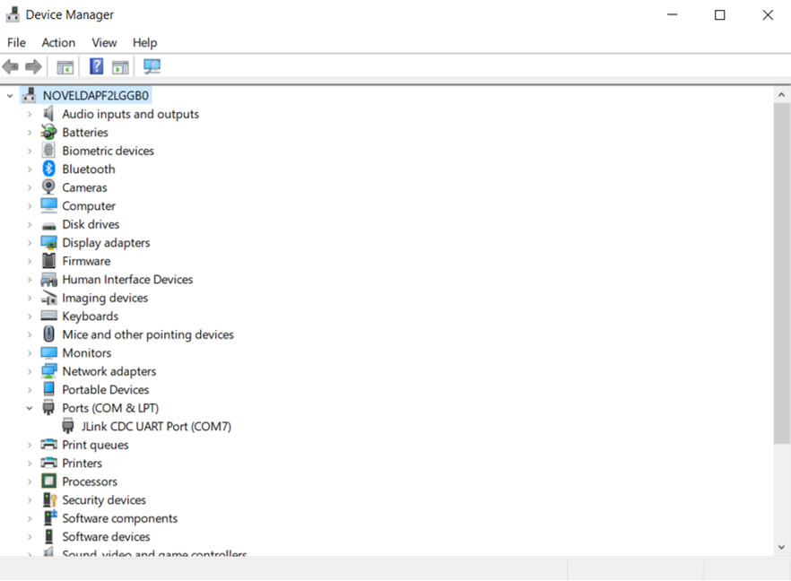
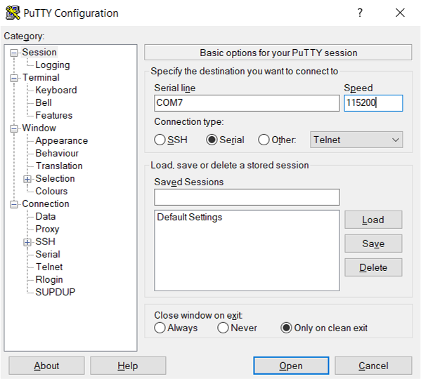
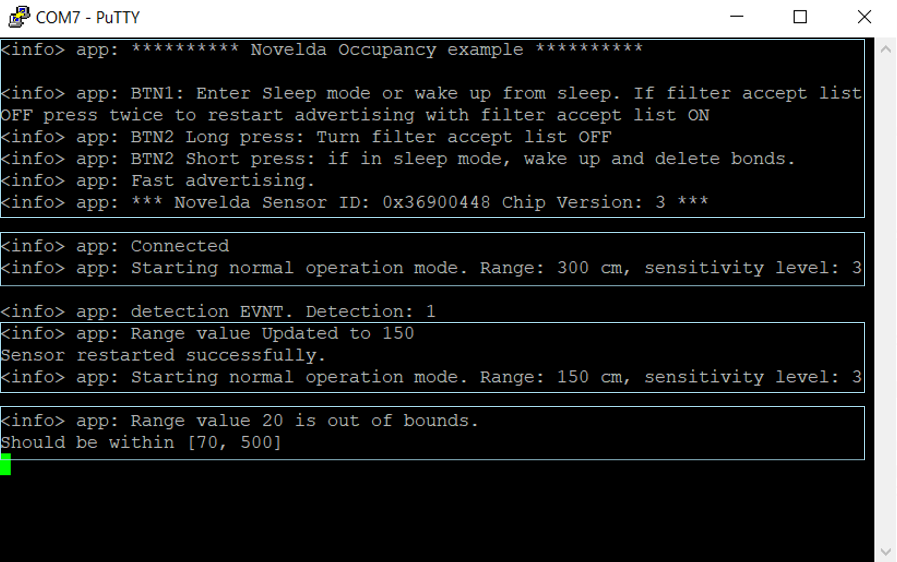
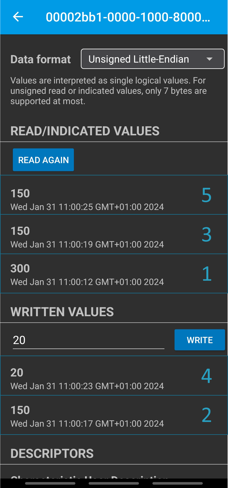

<link rel="stylesheet" href="images/style.css">

# Novelda BLE X4F103 Occupancy Application

## Introduction

This README provides a detailed overview of the Novelda BLE X4F103 Occupancy
Application. This document is intended to serve as a reference for setting
up and using the application effectively but it also includes some fundamentals
for the technologies used.

### Table of Contents

- [Technologies Fundamentals](#technology-fundamentals)
- [Getting Started](#getting-started)
- [Interacting with the Application](#interacting-with-the-application)
- [Application Overview](#application-overview)

---

## Technology Fundamentals

### Radar

The general principle of a radar system is to detect an object, this is done by
transmitting radio waves and measuring the incoming reflection to determine
angle, distance or both. Traditionally this has been done to bigger objects
such as planes or boats but nowadays it is used to track much smaller objects
like us humans.

Novelda’s radar sensors are Ultra-Wideband (UWB) sensors. UWB is a low-power,
short-range, wireless technology that operates through radio waves, defined in
the frequency range of the radio spectrum from 3.1 to 10.6 GHz and has a wide
channel bandwidth of 500 MHz or higher. UWB is used to sense objects and
people, to transmit data with short latency and to give information about the
location of an object or a person.

The sensor is designed to detect major and minor motion, as defined by NEMA.
It is also capable of detecting “working motion” which is Novelda’s definition
of a single person sitting doing typical office work.

### Novelda Occupancy and Proximity

Novelda uses two different algorithms for detection, [Occupancy](https://dev.novelda.com/getting_started/product_descriptions/occupancy.html)
and [Proximity](https://dev.novelda.com/getting_started/product_descriptions/proximity.html).
The occupancy algorithm is designed to detect the presence of people in various
building environments such as homes, offices and parking garages from a ceiling
mounted sensor. The proximity algorithm is designed to detect presence of
people relative to a vertically mounted device for touch-less human-machine
interaction such as vending machines, appliances and smart toilets. Read more
about the algorithms at [Novelda.com/Developer](https://novelda.com/developer).

### Bluetooth Low Energy

Bluetooth Low Energy (BLE) is a communications protocol operating in the 2.4
GHz frequency spectrum. Unlike Bluetooth Classic, BLE is designed to preserve
the battery making it ideal for battery powered applications who are meant to
last for years. For the purpose of this demo, you do not need to fully know
how BLE works, but it is important to know a little bit about the basics. If
you want to learn more about BLE, refer to the [Nordic website](https://www.nordicsemi.com/Products/Bluetooth-Low-Energy/What-is-Bluetooth-Low-Energy?lang=en#infotabs).

**Generic Access Profile (GAP)**

The Generic Access Profile (GAP) defines the connection functionality for BLE
devices. It handles how the BLE devices are discovered, how to establish and
terminate a connection, and handles the device configuration.

**Generic Attribute Profile (GATT)**

The Generic Attribute Profile (GATT) defines how the communication between
connected devices should be handled. In BLE data is shared between the devices
using characteristics. A collection of characteristics is called a service. The
value of a characteristic is stored in the memory of the device and each
characteristic has different permissions. These permissions dictate how the
connected device can interact with each characteristic. Commonly used
permissions are read, write, and notify.

So for example, in this application we have four different characteristics.
All four of these characteristics have the read permission, which means that
the user can connect to the BLE device that runs this application and
read out the value of all four characteristics. Read more about the application
specific characteristics [below](#via-ble).

## Getting Started

### Prerequisites

#### Hardware

To run this application you need a [Nordic nRF52840-DK](https://www.nordicsemi.com/Products/Development-hardware/nRF52840-DK)
and a X4F103 evaluation shield.

#### Software

1. Clone or download this repository.

2. Install dependencies:

<div align="center">

| Tool         | Version     |
|--------------|-----------|
| [make](https://gnuwin32.sourceforge.net/packages/make.htm)<sup>1</sup> |      |
| [Nordic command-line tools](https://www.nordicsemi.com/Products/Development-tools/nrf-command-line-tools/download)<sup>2</sup> |  |
| [ARM Toolchain](https://developer.arm.com/downloads/-/gnu-rm/9-2020-q2-update)<sup>2</sup> | Version 9-2020-q2-update |
| [NRF5 SDK](https://www.nordicsemi.com/Products/Development-software/nrf5-sdk/download) | 17.1.0 |

<sup>1</sup> *Can also be installed using Chocolatey:*
              ```choco install make```

<sup>2</sup> *The Nordic SDK should be installed in the root folder of the
              example. Your folder structure should look like this:*

</div>

   ```
   .ble_app_nrf52
   |__config
   |__hex
   |__images
   |__nRF5_SDK_17.1.0_ddde560
   |__pca10056
   |__source
   ```

<div align="center">

<sup>3</sup> *Do not check "add to path" as it can cause the existing paths to
              be overwritten.*

</div>

### Compiling and Flashing the Application

To build and flash the application, follow the steps below.

1. Navigate to the project makefile directory:
     ```v
     cd ble_app_nrf52/pca10056/s140/armgcc
     ```

2. Compile the example by running **make** in the terminal. If you have not
   downloaded the SDK in the recommended location, you have to manually change
   the SDK_ROOT variable in the makefile.
   ```bash
   make
   ```

3. Erase the flash on the device with the following command:
   ```bash
   make erase
   ```

4. Flash the Nordic BLE Soft Device (BLE stack) with the following command:
   ```bash
   make flash_softdevice
   ```

5. Flash the sample application with the following command:
   ```bash
   make flash
   ```

## Interacting with the Application

You can interact with the Novelda BLE Sensor Application in several ways: via
BLE using a mobile application like LightBlue, configuring a serial port, or
using the buttons on the nRF development board. The board also indicates the
connection status using LED1. The LED blinks when the device is advertising and
ready for connection, it lights up continuously when connected, and when in
sleep mode the LED is off.

### Configuring a Serial Port

Opening a serial port is an easy way to interact with the application as it
shows the UART (universal asynchronous receiver-transmitter) logs from the
application. These logs provide debugging information which can be useful for
monitoring the application's behavior and troubleshooting. You can use any
software that support opening serial ports. In this example we are using
[PuTTY](https://putty.org/).

To open the serial port, you need to know which COM port (communication port)
is associated with your device. To know this you need to open the Device
Manager, open the Ports (COM & LPT), and identify your device.



When you know the COM port you can open up a PuTTY window, choose "Serial" as
connection type, and then add your COM port to the "Serial line" box. Under
speed you should put 115200 which is the configured speed for this application.

You can view UART logs from the application by opening a serial console with a
speed configured for 115200. These logs provide debugging information that can
be useful for monitoring the application's behavior and troubleshooting.



#### Working with the Serial Port

When the serial port has been opened, you can now see all the UART messages
that are being sent from the application. When the application has been running
for a while, the log might look something like this:



If the serial port is open when the application is booting, you will see the
the startup information which is in the top box. The startup
information includes which sensor is being used but also an explanation on what
the buttons do, this is also explained further down in this
chapter.

The next box indicates that a scanner is connected to the
device and that the sensor is starting. It also displays which mode and which
parameters is used.

In the third box the logs shows that a request to modify the range
value had been made and that the sensor is rebooted with the new value. This
request is done from the phone app, and the corresponding method from the phone
point of view is done below.

The last box shows another request to modify the range to a value
that is outside the boundaries for the range value. This request is denied
gracefully, letting the user know the range interval accepted. How this request
is handled is also shown below.

### BLE Connection with a Smartphone

Connecting to the device with a BLE scanner enables you to interact with the
application to check the value of the characteristics but also make requests
to change the range, sensitivity, or timeout.

To be able to connect to the device with your smartphone, you need to download
a BLE scanner app. You can use any BLE scanner but in this document we are
using the LightBlue app. To connect to the device, open your scanner app and
scan for nearby BLE devices, and connect to the device called "Occupancy".

Once you are connected you have access to the occupancy service.
The occupancy service contains four characteristics:

- **Detection (UUID: 0x2BAD)**
   - Provides the current state (1 for presence, 0 for no presence).
- **Range (UUID: 0x2BB1)**
   - Allows reading and writing the range configuration for the sensor to
     specify how far it can detect objects.
   - Default value: **300 cm**
     - Min value: 70 cm
     - Max value: 500 cm
- **Sensitivity (UUID: 0x2BB2)**
   - Allows reading and writing the sensitivity configuration value to set
     how sensitive the sensor is to movement.
   - Default value in application: **3**
     - Min value: 1
     - Max value: 5
- **Timeout (UUID: 0x2BB3)**
   - Allows reading and writing a timeout defining how long the application
     waits after the sensor reports a state change (presence/no presence).
   - Default value in application: **10 seconds**

#### BLE Scanner App

Using a BLE scanner app is a simple way of interacting with the application and
enables you to both check and modify the values of each characteristic. Using
the scanner in combination with the serial terminal creates a powerful tool to
visualize and debug your application.

As previously mentioned, it is possible to make requests from the BLE scanner
app to the application to change the value of a characteristic. The image below
shows the LightBlue BLE scanner app inside the range characteristic. The range
characteristic has both write and read permissions which means that it is
possible to have a two-way communication with the device. The image shows a
series of read and write commands, corresponding to the
[serial terminal](#working-with-the-serial-port) view above. In the LightBlue
app, the sequence goes as follows:

1. **Read:** First we are reading to check the current range setting and as
 expected it is the default value, 300 cm.

2. **Write:** Now we want to decrease the range to 150 cm which is done by
 writing a new value to the range characteristic.

3. **Read:** Just to check that our value has actually changed we read it back
and verify that the range is in fact 150 cm.

4. **Write:** Now we want to decrease the range even further and try to modify
 the range value to something that is outside the accepted value to verify that
 the value remains unchanged.

5. **Read:** As expected the range is unchanged.



### Buttons on nRF52 Development Kit

You can also use two of the buttons on the development board, BUTTON1 and
BUTTON2 to interact with the application. The two buttons are used for
different things depending on which state the device is in. If need be, you
can also use the RESET button which reboots the application so you can start
fresh.

**During Advertising:**

When the device is advertising, meaning looking for a connection, BUTTON1 is
used to put the device in sleep mode. Long-pressing BUTTON2 turns off filter
accept list (called "whitelist" before Bluetooth Core specification v5.3). The
filter accept list contains a list of previously connected devices to speed up
the connection process.

**During Sleep:**

When the device is sleeping, both buttons can be used to wake the device up.
If you use BUTTON1 the device will simply wake up. If you use BUTTON2, the
device will wake up and delete the bond information.

**During Connection:**

When you are in a connection, long-pressing BUTTON1 will make it terminate the
connection.

## Application Overview

The Novelda BLE X4F103 Sample Application is designed to interface with
Novelda's X4F103 sensor using the Nordic nRF52840 platform. This application
facilitates the configuration and communication with the sensor via BLE,
allowing users to read, subscribe, and write to sensor characteristics. It also
provides UART logs for debugging.

### Project Structure

The application is organized into several modules, each serving a specific
purpose:

### main.c

- Initializes all application modules, interfaces, and services.
- Creates necessary tasks.
- Initializes and starts the BLE stack.
- Handles callback functions from the BLE stack and buttons.

### occupancy_service.c/.h

- Defines API to interface with the occupancy service.
- Defines the BLE occupancy service with four characteristics:
  1. Detection (Read/Notify, UUID=0x2BAD)
  2. Range (Read/Write/Write No Rsp, UUID=0x2BB1)
  3. Sensitivity (Read/Write/Write No Rsp, UUID=0x2BB2)
  4. Timeout (Read/Write/Write No Rsp, UUID=0x2BB3).
- Interfaces with the BLE stack to receive and report characteristic values.
- Relays configuration changes to the occupancy module.

### occupancy.c/.h

- Implements higher level occupancy functionality.
- Provides simplified APIs to interact with the Novelda sensor:
  - Start and stop the sensor.
  - Configure sensitivity, range, and timeout.
  - Process sensor events.
- Interfaces with novelda_sensor module.

### novelda_sensor.c/.h

- Interfaces with the sensor via the novelda_chipinterface.
- Manages the sensor independently from the main application by using its own
  task.
- Provides APIs to initialize and run the sensor, stop the sensor, and manage
  related peripherals.

### chipinterface_nrf.c

- Provides an implementation of the Novelda Chip Interface for the NRF platform.
- Includes functions for interfacing with the Novelda chip via I2C or SPI.
- Manages GPIO pins and handles interrupts and semaphores.
- Supports the NRF platform and provides hardware abstraction for the Novelda
  X4 chip.

### Application Tasks

The application consists of three primary tasks:

1. **occupancy_task**
   - A simple application task with a semaphore.
   - Handles the event "EVENT_SENSOR_PRESENCE," triggered every time the
     Novelda sensor's IRQ line toggles.
   - If needed further application related functionalities can be developed
     under this task.

2. **sensor_run_thread**
   - Initializes and runs the sensor independently from the main application.

3. **softdevice_task**
   - Manages the Nordic Soft Device, which implements the BLE stack.
